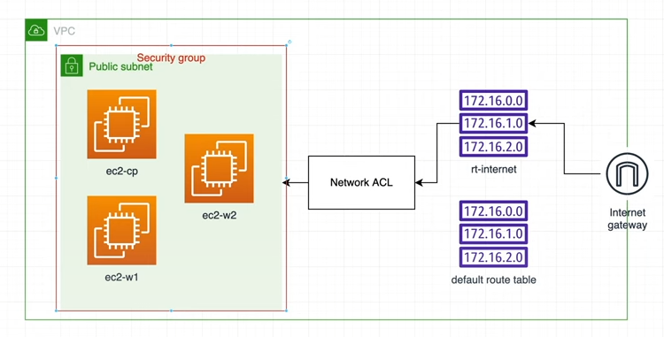

## AWS Setup for K8s cluster

### Diagram:

### Description:

VPC: "Virtual Private Cloud", it is the global virtual network that span all regions. Contains "subnets".

Public Subnet: A type of subnet that has a direct route to an internet gateway. Can access the public internet.

ec2-cp: This is the control plane node which manages the worker nodes.
ec2-w1/2: Worker nodes, these nodes actually contain the containerized applications

Network ACL: Sort of like a stateless firewall, has rules for whether to allow access to a computer env or deny it. Controls incoming/outgoing traffic.
Route table: Contains a set of rules, called routes, that determine where network traffic from subet or gateway is directed.
Internet gateway: Communication between your VPC and the internet.

### Steps:

1. Grab public IP for connection to EC2 instance
2. ssh into instances (3) from terminals (ssh -i "id" ubuntu@<ip>)
3. update packages (sudo apt-get update)
4. upgrade packages (sudo apt-get upgrade)
5. set hostname for 3 instances (sudo hostnamectl set-hostname <hostname>)
6. add hosts (sudo nano /etc/hosts/) add ipv4 and hostname for each
